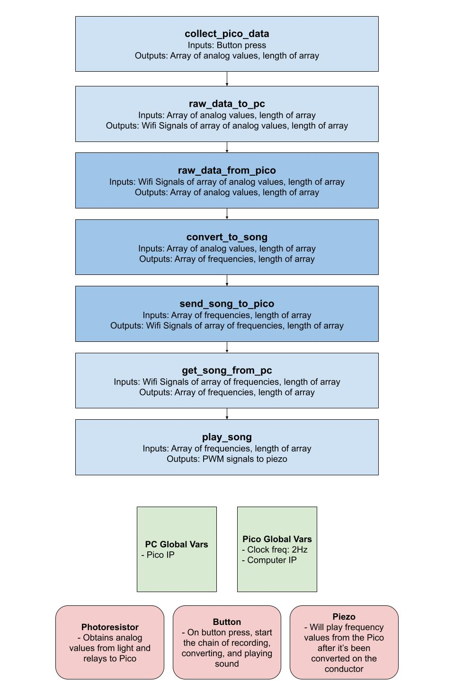
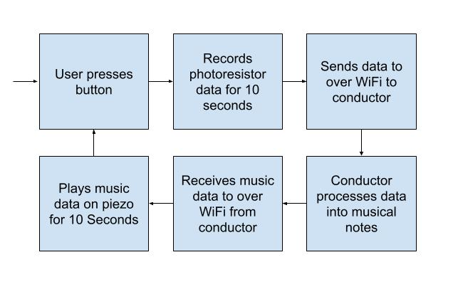

# 2025 Fall ECE Senior Design Miniproject

[Project definition](./Project.md)

This project uses the Raspberry Pi Pico 2WH SC1634 (wireless, with header pins).

Each team must provide a micro-USB cable that connects to their laptop to plug into the Pi Pico.
The cord must have the data pins connected.
Splitter cords with multiple types of connectors fanning out may not have data pins connected.
Such micro-USB cords can be found locally at Microcenter, convenience stores, etc.
The student laptop is used to program the Pi Pico.
The laptop software to program and debug the Pi Pico works on macOS, Windows, and Linux.

This miniproject focuses on using
[MicroPython](./doc/micropython.md)
using
[Thonny IDE](./doc/thonny.md).
Other IDE can be used, including Visual Studio Code or
[rshell](./doc/rshell.md).

## Hardware

* Raspberry Pi Pico WH [SC1634](https://pip.raspberrypi.com/categories/1088-raspberry-pi-pico-2-w) (WiFi, Bluetooth, with header pins)
* Freenove Pico breakout board [FNK0081](https://store.freenove.com/products/fnk0081)
* Piezo Buzzer SameSky CPT-3095C-300
* 10k ohm resistor
* 2 [tactile switches](hhttps://www.mouser.com/ProductDetail/E-Switch/TL59NF160Q?qs=QtyuwXswaQgJqDRR55vEFA%3D%3D)

### Photoresistor details

The photoresistor uses the 10k ohm resistor as a voltage divider
[circuit](./doc/photoresistor.md).
The 10k ohm resistor connects to "3V3" and to ADC2.
The photoresistor connects to the ADC2 and to AGND.
Polarity is not important for this resistor and photoresistor.

The MicroPython
[machine.ADC](https://docs.micropython.org/en/latest/library/machine.ADC.html)
class is used to read the analog voltage from the photoresistor.
The `machine.ADC(id)` value corresponds to the "GP" pin number.
On the Pico W, GP28 is ADC2, accessed with `machine.ADC(28)`.

### Piezo buzzer details

PWM (Pulse Width Modulation) can be used to generate analog signals from digital outputs.
The Raspberry Pi Pico has eight PWM groups each with two PWM channels.
The [Pico WH pinout diagram](https://datasheets.raspberrypi.com/picow/PicoW-A4-Pinout.pdf)
shows that almost all Pico pins can be used for multiple distinct tasks as configured by MicroPython code or other software.
In this exercise, we will generate a PWM signal to drive a speaker.

GP16 is one of the pins that can be used to generate PWM signals.
Connect the speaker with the black wire (negative) to GND and the red wire (positive) to GP16.

In a more complete project, we would use additional resistors and capacitors with an amplifer to boost the sound output to a louder level with a bigger speaker.
The sound output is quiet but usable for this exercise.

Musical notes correspond to particular base frequencies and typically have rich harmonics in typical musical instruments.
An example soundboard showing note frequencies is [clickable](https://muted.io/note-frequencies/).
Over human history, the corresspondance of notes to frequencies has changed over time and location and musical cultures.
For the question below, feel free to use musical scale of your choice!

[Music Examples](https://github.com/twisst/Music-for-Raspberry-Pi-Pico/blob/main/play.py)


## Notes

Pico MicroPython time.sleep() doesn't error for negative values even though such are obviously incorrect--it is undefined for a system to sleep for negative time.
Duty cycle greater than 1 is undefined, so we clip the duty cycle to the range [0, 1].


## Reference

* [Pico 2WH pinout diagram](https://datasheets.raspberrypi.com/picow/pico-2-w-pinout.pdf) shows the connections to analog and digital IO.
* Getting Started with Pi Pico [book](https://datasheets.raspberrypi.com/pico/getting-started-with-pico.pdf)


# Team 12's Mini Project

## Final Product

## Design
The ideal flow that we came up with for the light orchestra is that the user presses a button, inputs the intensity of light on the photoresistor for 10 seconds, waits for the data to be processed, and then outputs the corresponding notes on the piezo buzzer. This process can be viewed [here](./doc/Team%2012%20Mini-Project%20Process%20Flow.pdf)

## Our Process
<p>To split up tasks, in our first initial meeting we collaboratively created Figure 1 to figure out the overarching flow of the mini project. We then split up the functions to work on in parallel individually and used the "Issues" tab in Github to assign to each person. We also tracked the progress of all the issues using the Github "Projects" board (not started, in progress, done). </p>

<p>Figure 1: The above figure shows a high level organization of our code from functions, global variables, and hardware components we are working with. We split up the functions and assigned per person to be able to work in parallel for time efficiency and utilized the agile development process for integration as well.</p>

<p>Figure 2: The above figure shows the process of how our system takes in user input and processes the light intensity to, send data from pico to PC, convert into song form, and output data again over wifi to play on the pico.</p>

<p> As a team, we got together and defined both our function calls and how the data will be moved. We compiled it into a Google Drawing and delegated tasks to each of the members of our team. We also defined how the core components, like the photosensor, button, and piezo, will work. We figured that we'd get the core functionality of the Orchestra working before adding other things like indicator lights. </p>


## Design Changes
Alberto and Justin were originally planning on using the API contract already defined in the [Project.md](./Project.md) file as our base structure for communicating between devices. As we started development, we realized that the implementation would be easier if we decided to change the API Contract a bit to better suit our proposed dataflow from the design. For this reason, we came up withe following API Calls:

`GET /sensor`
: Returns the current reading from the photoresistor.

```json
{
  "raw_data_array": [514,733,678],
  "entries": 3
}
```

raw_data_array: An array of all of the raw sensor data values.
entries: The number of elements in raw_data_array.


`POST /melody`
: Sends the frequency values from the conductor.

```json
{
  "notes": [523,659,784],
  "entries": 3
}
```
notes: An array of all of the frequencies to be played by the piezo.
entries: The number of elements in notes.

<p> During testing we wanted a visual indicator showing what stage in the process (idle, recording, playing) the pico was in. Since we are using the Agile design scheme, we want back to the design phase and Hannah implemented the RGB LED to display white during idle, pink during recording, and blue during playing.</p>
